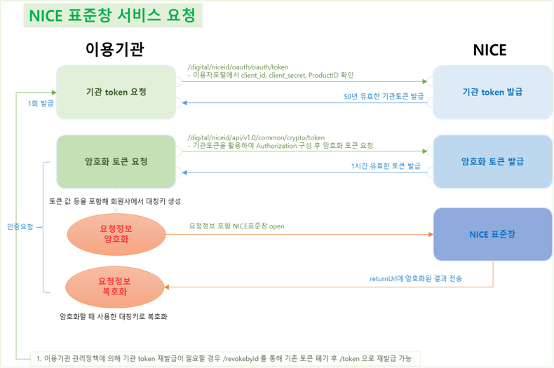

# Nice API - PASS 본인인증 연동

전체적인 흐름 : "기관 토큰 발급 ➜ 암호화 토큰 발급 ➜ 대칭키 생성 ➜ 요청정보 암호화 및 무결성체크캆 생성 ➜ NICE 표준창 호출 ➜ 인증 결과 처리"
1. 우선은 기관 토큰이 필요한데 50년 유효하기 때문에 초기에 발급 받은 후 매 본인인증 요청 시 마다 실행되지 않도록 한다. 이때 기관 토큰은 yaml파일에서 관리하도록 하자.
2. 암호화 토큰 요청 시 유효 시간은 1시간이다. 따라서 굳이 매 본인인증 요청마다 요청하지말고 ElastiCache(Redis)를 활용해서 유효기간을 1시간으로 설정하여 만약 GET 했을때 null일때만 암호화 토큰을 요청하는 식으로 구현하자.
3. 암호화 토큰 발급 시 사용한 요청 및 응답 값을 통해 대칭키(key,iv)와 무결성키(hmac_key) 생성
4. 나이스 본인인증 화면을 호출하기 위한 요청 값을 위에서 생성한 대칭키로 암호화. 이때 returnUrl과 methodType으로 본인인증 처리 결과가 오기 때문에 해당 API를 생성해둬야 한다.
5. Hmac 무결성체크값(integrity_value) 생성

➜ 여기까지 생성한 값들(key, iv, hmac_key)을 Redis로 55분 만료 기간 지정 후 저장해두고 꺼내쓰자. 
6. 암호화 토큰 발급 API에서 응답 시 받은 token_version_id와 enc_data(암호화한 요청 정보) 그리고 enc_data의 무결성 체크값(integrity_value)를 프론트로 던져주고 프론트에서 표준창 호출
7. 인증이 완료된 후 returnUrl로 오는 인증 결과를 key, iv를 통해 복호화하고 인증 결과 데이터를 처리한다. 